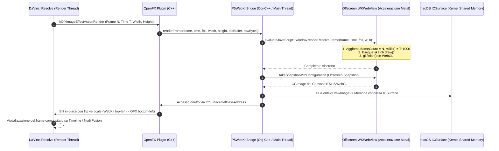

# Guida Completa: Plugin Nativo DaVinci Resolve per p5.js (macOS)
### *P5.js Canvas Generator OpenFX Plugin (WebKit + IOSurface Zero-Copy Engine)*

Benvenuto nella documentazione ufficiale di **P5.js Canvas Generator**, il generatore OpenFX nativo per macOS progettato per eseguire sketch standard di **p5.js** e librerie JavaScript esterne direttamente all'interno della Timeline e della pagina Fusion di **DaVinci Resolve** con scrubbing deterministico al singolo frame.

---

## 1. Architettura Tecnica & Ciclo di Vita del Frame

### Schema del Flusso Dati (Render Action -> WebKit -> IOSurface -> Timeline)



### Come Funziona il Bridge WebKit <-> IOSurface (Zero-Copy)

1. **Host WebKit Headless con Finestra Offscreen**:
   - WebKit (`WKWebView`) su macOS richiede un contesto di rendering attivo per abilitare l'accelerazione Metal e WebGL completa. Il plugin crea una `NSWindow` trasparente e senza bordi posizionata fuori schermo (`x = -20000, y = -20000`).
   - La webview ha lo sfondo trasparente (`drawsBackground = NO`), consentendo il rendering con canale Alpha nativo sopra i video della timeline.

2. **Condivisione di Memoria Kernel tramite `IOSurface`**:
   - `IOSurface` è il framework di sistema di Apple per la condivisione di buffer grafici ad altissima velocità tra processi e sottosistemi GPU senza copie intermedie della CPU.
   - Quando WebKit acquisisce lo snapshot del canvas, il buffer viene riversato direttamente nell'area di memoria virtuale mappata da `IOSurfaceCreate`.
   - Il plugin accede istantaneamente ai puntatori di memoria (`IOSurfaceGetBaseAddress`) ed esegue il blit direttamente nel buffer di output fornito da DaVinci Resolve.

3. **Sincronizzazione Thread-Safe tra Worker Render Threads e Cocoa Main Thread**:
   - DaVinci Resolve invoca `kOfxImageEffectActionRender` da un pool di worker thread di rendering in background.
   - Le API di WebKit richiedono l'esecuzione sul Main Dispatch Queue (`dispatch_get_main_queue()`).
   - Il bridge coordina la chiamata tramite `dispatch_async` verso il Main Thread e un semaforo con watchdog di sicurezza (3.0 secondi). Se uno sketch dell'utente entra in un loop infinito o stalla, DaVinci Resolve non si blocca mai e continua l'esecuzione in sicurezza.

4. **Allineamento delle Coordinate Verticali**:
   - Lo standard OpenFX adotta l'origine in basso a sinistra $(y=0$ in basso), mentre HTML5 Canvas e WebKit adottano l'origine in alto a sinistra $(y=0$ in alto).
   - Il transfer di memoria effettua il flip verticale istantaneo durante la scansione delle righe (`dstRow = dstBytes + (height - 1 - y) * dstRowBytes`), garantendo proporzioni e orientamento perfetti.

---

## 2. Guida all'Installazione & Compilazione

### Prerequisiti di Sistema
- **macOS**: 12.0 (Monterey) o successivo (Apple Silicon M1/M2/M3/M4 o Intel Mac).
- **DaVinci Resolve**: Studio o versione Free (Resolve 17, 18, 19+).
- **Strumenti di Compilazione**: Command Line Tools di Apple (`clang++`) e `cmake` (es. installabile via Homebrew: `brew install cmake`).

### Compilazione del Bundle OpenFX

Apri il Terminale ed esegui:

```bash
# 1. Posizionati nella directory del progetto
cd /Users/mariosalvucci/Documents/Development/WEBDEV/_DAVINCI_P5JS

# 2. Crea la cartella di build e configura CMake
mkdir -p build && cd build
DEVELOPER_DIR=/Library/Developer/CommandLineTools cmake ..

# 3. Compila il plugin e l'harness di test
DEVELOPER_DIR=/Library/Developer/CommandLineTools cmake --build .
```

Il comando genererà il bundle nativo:
`build/P5Generator.ofx.bundle`

### Test di Validazione Offline (Test Harness)
Prima di avviare DaVinci Resolve, puoi verificare il corretto funzionamento di WebKit e della memoria IOSurface eseguendo il test automatico:

```bash
./test_p5_bridge
```

*Output atteso:*
```
==================================================
 Running Standalone P5 WebKit <-> IOSurface Test  
==================================================
[Test] Initializing P5WebKitBridge...
[Test] WebKit ready state: YES
[Test 1] Rendering Frame 0 (Expected: RED)...
[Test 1 Result] Frame 0 Center Pixel: RGBA(200, 100, 50, 255)
[Test 2] Rendering Frame 10...
[Test 2 Result] Frame 10 Center Pixel: RGBA(10, 20, 220, 255)
==================================================
 SUCCESS! All WebKit & IOSurface tests passed!    
 Deterministic frame clock verified accurately.   
==================================================
```

### Installazione del Bundle in DaVinci Resolve

Per rendere il plugin disponibile all'interno di DaVinci Resolve, copia il bundle nella cartella di sistema dei plugin OpenFX:

#### Metodo 1: Installazione a Livello di Sistema (Consigliata)
```bash
sudo mkdir -p /Library/OFX/Plugins
sudo cp -R P5Generator.ofx.bundle /Library/OFX/Plugins/
```

#### Metodo 2: Installazione a Livello Utente
```bash
mkdir -p "$HOME/Library/Application Support/Blackmagic Design/DaVinci Resolve/OFX/Plugins"
cp -R P5Generator.ofx.bundle "$HOME/Library/Application Support/Blackmagic Design/DaVinci Resolve/OFX/Plugins/"
```

Al successivo avvio di DaVinci Resolve, il generatore verrà caricato automaticamente.

---

## 3. Guida Utente: Utilizzo in DaVinci Resolve (Zero-Friction)

1. **Aggiunta sulla Timeline (Pagina Edit)**:
   - Apri DaVinci Resolve e vai nella **Edit Page**.
   - Apri il pannello **Effects** (in alto a sinistra).
   - Scorri fino alla sezione **Generators**.
   - Troverai **P5.js Canvas Generator**: trascinalo su una traccia video della Timeline.
2. **Personalizzazione nell'Inspector**:
   - Seleziona il generatore sulla timeline e apri l'**Inspector** in alto a destra.
   - Nella scheda **Generator**, vedrai i campi dedicati:
     - **p5.js Sketch Code**: Campo di testo ampio dove incollare o scrivere il codice dello sketch (`setup()`, `draw()`, ecc.).
     - **External CDN Libraries**: Elenco di URL di librerie esterne da importare via Web (uno per riga).
     - **Scrubbing Mode**:
       - *Deterministic Time (Stateless)*: Ideale per grafica matematica, noise e animazioni temporizzate (`frameCount`, `millis()`). Navigazione istantanea avanti e indietro sulla timeline.
       - *Cumulative Step Simulation*: Ideale per sistemi fisici o particelle che accumulano stati sequenziali.
     - **Pulsante "Reload / Recompile"**: Cliccalo ogni volta che modifichi il codice o aggiungi una libreria CDN per ricompilare all'istante l'ambiente WebKit.
     - **Engine Status**: Mostra lo stato di compilazione o eventuali messaggi di errore runtime.

---

## 4. Esempi Pratici di Sketch

### Esempio 1: Generatore 2D Deterministico Reattivo alla Timeline
Questo sketch dimostra una composizione circolare con rumore di Perlin e gradiente colore sincronizzata perfettamente al frame corrente:

```javascript
function setup() {
  createCanvas(width, height);
  colorMode(HSB, 360, 100, 100, 1.0);
  noStroke();
}

function draw() {
  // Sfondo trasparente per compositing sulla traccia video sottostante
  clear();

  let cx = width / 2;
  let cy = height / 2;
  // millis() riflette il tempo in millisecondi della timeline di Resolve
  let t = millis() * 0.0012;

  let numRays = 72;
  let maxRadius = min(width, height) * 0.42;

  for (let i = 0; i < numRays; i++) {
    let angle = (TWO_PI / numRays) * i;
    let n = noise(cos(angle) * 1.5 + 1, sin(angle) * 1.5 + 1, t);
    let r = map(n, 0, 1, maxRadius * 0.3, maxRadius);

    let x = cx + cos(angle + t * 0.3) * r;
    let y = cy + sin(angle + t * 0.3) * r;

    let hue = (i * (360 / numRays) + frameCount * 2) % 360;
    fill(hue, 85, 95, 0.9);
    circle(x, y, 12 + sin(t * 3 + i) * 6);
  }
}
```

---

### Esempio 2: 3D WebGL con Libreria Esterna CDN (Simplex Noise)

Nel campo **External CDN Libraries** inserisci il seguente link:
```text
https://cdnjs.cloudflare.com/ajax/libs/simplex-noise/2.4.0/simplex-noise.min.js
```

Nel campo **p5.js Sketch Code** incolla:
```javascript
let simplex;

function setup() {
  // Pieno supporto al rendering 3D WebGL accelerato su GPU Metal
  createCanvas(width, height, WEBGL);
  simplex = new SimplexNoise();
}

function draw() {
  background(12, 14, 20);

  // Illuminazione direzionale e ambientale
  ambientLight(70, 80, 120);
  directionalLight(255, 230, 200, 0.5, 0.8, -1);

  // Rotazione legata al tempo e al frame della timeline
  rotateX(frameCount * 0.012);
  rotateY(millis() * 0.0008);

  let detail = 24;
  let size = min(width, height) * 0.28;

  normalMaterial();
  push();
  for (let i = 0; i < 6; i++) {
    push();
    rotateZ((TWO_PI / 6) * i);
    translate(size * 0.7, 0, 0);
    rotateX(frameCount * 0.02 + i);
    
    // Valore calcolato con la libreria esterna Simplex Noise caricata da CDN
    let n = simplex.noise2D(i * 0.2, frameCount * 0.015);
    let scaleFactor = map(n, -1, 1, 0.6, 1.4);
    scale(scaleFactor);

    torus(size * 0.25, size * 0.08, detail, detail);
    pop();
  }
  pop();
}
```
*Clicca su **Reload / Recompile** nell'Inspector. Lo script verrà scaricato dal CDN ed eseguito immediatamente in 3D WebGL sulla timeline.*

---

## 5. Modalità FX (Filter): Guida a `videoIn` e `audioIn`

Oltre alla modalità generatore autonoma, il plugin include la modalità **Filter Effect** (`P5.js Canvas Effect`), applicabile direttamente come effetto sopra qualsiasi clip video sulla timeline di DaVinci Resolve.

### Dove trovarlo in DaVinci Resolve
- Nella pagina **Edit**: apri il pannello **Effects** -> **OpenFX** -> **Filters** -> trascina **P5.js Canvas Effect** sulla clip video desiderata.
- Nella pagina **Color** o **Fusion**: aggiungi **P5.js Canvas Effect** come nodo di elaborazione immagine.

---

### Utilizzo dell'hook `videoIn`
`videoIn` espone il frame video corrente della clip sottostante con la massima compatibilità verso le API di Processing e p5.js:

1. **Disegno Diretto del Video sulla Timeline**:
   ```javascript
   image(videoIn, 0, 0); // Risoluzione originale
   image(videoIn, 0, 0, width, height); // Scalato alla risoluzione del canvas
   ```

2. **Campionamento Colore Pixel**:
   ```javascript
   let col = videoIn.get(mouseX, mouseY); // Restituisce [R, G, B, A]
   fill(col[0], col[1], col[2]);
   ```

3. **Manipolazione Pixel ad Alte Prestazioni**:
   ```javascript
   videoIn.loadPixels();
   for (let i = 0; i < videoIn.pixels.length; i += 4) {
     let r = videoIn.pixels[i];
     let g = videoIn.pixels[i + 1];
     let b = videoIn.pixels[i + 2];
     // elaborazione pixel...
   }
   ```

4. **Uso come Texture in 3D WebGL**:
   ```javascript
   function setup() {
     createCanvas(width, height, WEBGL);
   }
   function draw() {
     texture(videoIn);
     rotateY(millis() * 0.001);
     box(200);
   }
   ```

---

### Utilizzo dell'hook `audioIn`
Poiché OpenFX non riceve flussi audio nativi dalle clip di DaVinci Resolve, il plugin fornisce 2 modalità di alimentazione audio selezionabili nell'Inspector:

1. **Modalità File Audio/Video (Deterministica & Accurata)**:
   - Nell'Inspector seleziona il percorso del file audio (`.wav`, `.mp3`, `.m4a`) o video (`.mp4`, `.mov`) nel campo **Audio Track / Media File**.
   - Il plugin decodifica l'audio con macOS `AudioToolbox` ed esegue un'analisi spettrale FFT ad altissima velocità con Apple `Accelerate` `vDSP`.
   - L'audio è **perfettamente sincronizzato al millisecondo del frame corrente**, sia durante lo scrubbing avanti/indietro sia durante il render finale di export!

2. **Modalità Live WebAudio / Microfono**:
   - Cattura in tempo reale l'audio dal microfono o dal loopback di sistema (es. BlackHole) durante il playback.

#### Proprietà e Metodi di `audioIn`:
- `audioIn.getLevel()`: Ampiezza RMS complessiva normalizzata (valore float tra `0.0` e `1.0`).
- `audioIn.amplitude`: Alias float di `getLevel()`.
- `audioIn.peak`: Picco audio istantaneo (`0.0` - `1.0`).
- `audioIn.bass`: Energia della banda delle basse frequenze (bassi/sub, `0.0` - `1.0`).
- `audioIn.mid`: Energia della banda delle medie frequenze (`0.0` - `1.0`).
- `audioIn.treble`: Energia della banda delle alte frequenze (`0.0` - `1.0`).
- `audioIn.waveform()` o `audioIn.getWaveform()`: Array di 128 campioni PCM normalizzati tra `-1.0` e `1.0`.
- `audioIn.fft()` o `audioIn.getSpectrum()`: Array di ampiezze frequenziali normalizzate tra `0.0` e `1.0`.

---

### Esempio: Glitch Video & Griglia di Pixel Reattiva all'Audio

```javascript
function setup() {
  createCanvas(width, height);
  noStroke();
}

function draw() {
  // Disegna il video originale
  image(videoIn, 0, 0, width, height);

  let level = audioIn.getLevel();
  let bass = audioIn.bass;
  let step = 24;

  // Campiona i pixel del video e crea un effetto particellare modulato dall'audio
  for (let y = 0; y < height; y += step) {
    for (let x = 0; x < width; x += step) {
      let col = videoIn.get(x, y);
      let brightness = (col[0] + col[1] + col[2]) / (3 * 255.0);

      if (brightness > 0.3) {
        fill(col[0], col[1], col[2], 180);
        let sz = (step * 0.8) * brightness * (1.0 + bass * 2.0);
        rect(x, y, sz, sz);
      }
    }
  }

  // Disegna l'oscilloscopio audio in basso
  let wave = audioIn.waveform();
  stroke(0, 255, 200, 200);
  strokeWeight(2);
  noFill();
  beginShape();
  for (let i = 0; i < wave.length; i++) {
    let wx = map(i, 0, wave.length, 0, width);
    let wy = height - 50 + wave[i] * 50;
    vertex(wx, wy);
  }
  endShape();
  noStroke();
}
```

---

## 6. Checklist di Debug & Linee Guida di Ottimizzazione

| Aspetto | Linea Guida & Best Practice |
| :--- | :--- |
| **Sincronizzazione Frame** | Usa `frameCount`, `millis()`, o `deltaTime`. Sono tutti sincronizzati automaticamente all'indice del frame e al framerate della timeline di Resolve. |
| **Evita Loop Asincroni** | Non usare `setInterval()` o `requestAnimationFrame()` manuali. Il plugin gestisce internamente il trigger sincrono di `draw()` in base alla riproduzione di Resolve. |
| **Asset Esterni e `preload()`** | Evita di caricare immagini o file pesanti tramite `loadImage("http://...")` all'interno di `preload()` durante la riproduzione in tempo reale sulla timeline: la latenza di rete rallenterebbe lo scrubbing. Se hai bisogno di immagini o font, incorporali come data URL (base64) o usali in locale. |
| **Gestione Errori JS** | Se commetti un errore di sintassi JavaScript (es. variabile non definita o parentesi mancante), sullo schermo apparirà un banner rosso semitrasparente con il dettaglio della linea e l'errore esatto, e il plugin continuerà a girare senza mandare in crash DaVinci Resolve. |
| **Risoluzione Automatica** | `width`, `height`, `windowWidth` e `windowHeight` riflettono sempre la risoluzione impostata in DaVinci Resolve (es. 1920x1080, 3840x2160, 1080x1920 per Reel/Shorts verticali). Non è necessario codificare risoluzioni fisse nello sketch. |
| **videoIn & audioIn** | Disponibili automaticamente nella modalità **P5.js Canvas Effect**. In assenza di file audio, `audioIn` fornisce valori neutri e silenziosi prevenendo qualsiasi crash dello sketch. |
